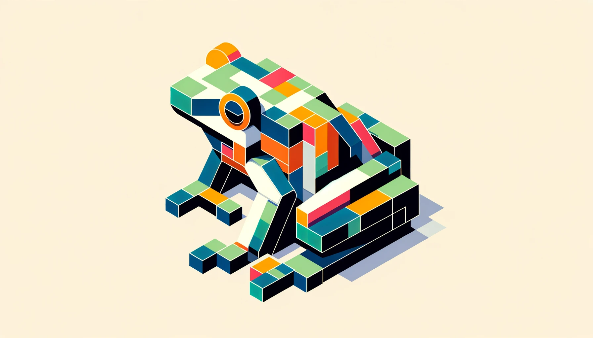

# Ribbit Project
# 

## Description
The Ribbit project is an image upscaling solution that uses deep learning techniques, specifically Generative Adversarial Networks (GANs), to enhance the resolution of images. It's designed to upscale low-resolution images into higher-resolution counterparts, providing clearer, more detailed results.

## Installation
To run the Ribbit notebook, you need to install the required Python packages. Follow these steps:

1. **Ensure Python is Installed:**  
   If not already installed, download and install Python from [Python's official site](https://www.python.org/downloads/).

2. **Install Jupyter Notebook:**  
   Use pip to install the Jupyter Notebook.
   ```bash
   pip install notebook
   ```
## Clone the Repository:
Clone this repository to your local machine.
 ```bash
git clone https://github.com/Suket-Shubhankar/Ribbit.git
```
## Install Dependencies:
If you have a requirements.txt file, install the necessary Python packages.
```bash
pip install -r requirements.txt
```
## Start Jupyter Notebook:
Open a terminal and navigate to the repository's directory.
 
 ```bash
jupyter notebook
```

## Open the Notebook:
In the Jupyter interface, navigate to the Ribbit.ipynb file and open it.

## Run the Notebook:
Execute the cells in the notebook to see the results.

# Usage
The project is structured to process images in a specific way:

Images from the DIV2K dataset are used, a common benchmark in super-resolution tasks.
Images are first cropped to 256x256 pixels and then downscaled to 64x64 pixels, simulating the upscaling task.
The project includes two main components: the Generator and the Discriminator, forming the GAN.
To use the Ribbit Image Upscaler:

Place your low-resolution images in the designated input folder.
Run the notebook or the Python script to perform the upscaling.
The upscaled images will be saved in the specified output folder.

# Models

## Generator:
Responsible for creating high-resolution images from low-resolution inputs. It uses Convolutional Neural Networks (CNNs) and PixelShuffle for upscaling.

## Discriminator:
Differentiates between the high-resolution images produced by the Generator and the original high-resolution images. It's a CNN-based classifier.


 

